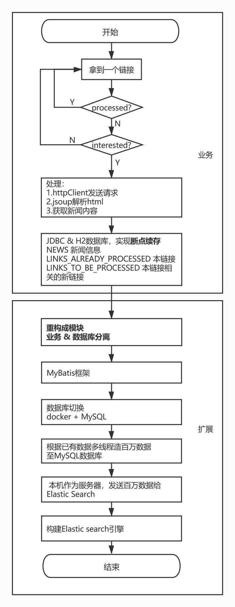

## 多线程爬虫及ES数据分析

涉及技术：Java/HTTP/JSON/HTML/Cookie/jsoup/IDEA/MySQL/ElasticSearch

**1.使用插件**

spotBugs(辅助发现bug)

checkStyle(规范代码格式)

circleCI(辅助提高代码质量)

flyway(进行数据库结构的版本管理)

**2.流程图**

**3.业务逻辑**

爬取新浪新闻页->使用数据库存储并进行数据分析->随着数据量的增长，迁移到Elastic Search->做一个简单的“新闻搜索引擎”

**4.扩展**

(1) jdbc连接数据库，实现断点续存

(2) 采用MyBatis框架连接数据库

(3) 切换数据库：docker & MySQL

(4) 造百万数据至数据库

(5) 构造ElasticSearch搜索引擎

